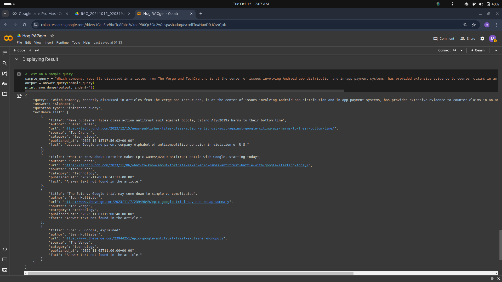

# Hog RAGger - Retrieval-Augmented Generation Pipeline

## Video Link

<a href="https://drive.google.com/file/d/1ipcxQTetQP4h2yDQS59PXMzOpJKw5pTX/view?usp=sharing">Video Explanation 1</a>

<a href="https://drive.google.com/file/d/1xKYxOXRSxPkcmBxjY7zqjGtH-5Qmrcfi/view?usp=sharing">Video Explanation 2</a>

## Output

## How to run the repo

- Upload the `Hog RAGger.ipynb` file to google colab.
- Along with that, upload the `corpus.json` fileto colab.
- Then, just run all the cells.
- To, give your own query, go to the last cell, and enter your query in the `query` variable, present in the last cell.

## Tech Stack

- Python
- FAISS Python module - to find similar articles from `corpus.json` based on query
- RAG-like pipeline 
- Hugging Face - Google T5 Model - Text-to-Text Transfer Transformer

## Requirements.txt

This file is present in this Hog RAGger folder.

## Overview

Everything is explained in the `Hog RAGger.ipynb` file. Every code cell has a readme cell above that explains the solution.

## References

- Hugging Face models
- Luv Bhaiya Amazon ML Repository
- Goooooooooooogle searches
